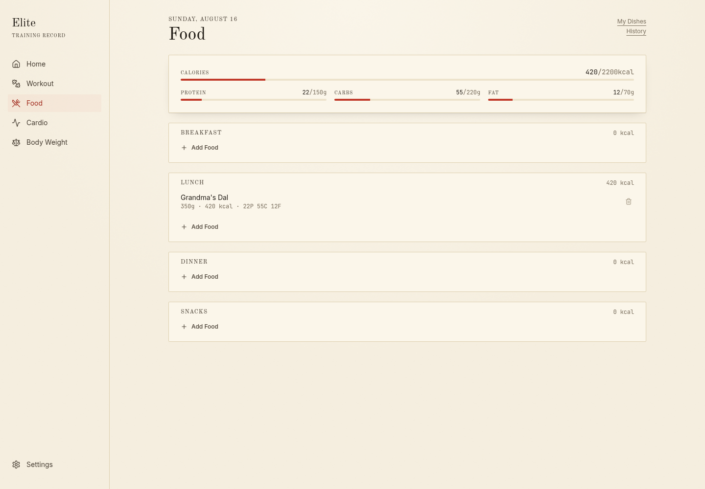
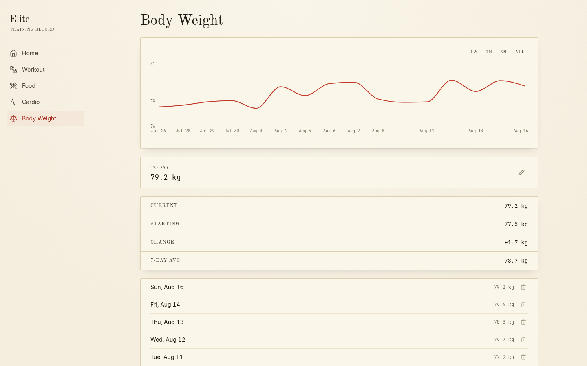

# Elite

A personal training log that turns "how hard did I actually work this week" into something you can *see* instead of scroll through.

I built this because I was tracking workouts, food, cardio, and body weight across three different apps, none of which talked to each other, and none of which made the data feel like anything. I wanted one place, on my phone and on my desktop, that stored everything locally, needed no account, and — the actual point — showed my effort back to me visually instead of as a wall of numbers.


## What it actually does

**Workout** is the centerpiece. There's an anatomical muscle map (front and back) that fills in like ink on paper as you log sets — the color intensity is literally today's volume (weight × reps) for that muscle, normalized so a small muscle like biceps saturates at a lower load than something like quads. Tap a muscle to see exactly which exercises hit it today. Log a new personal record and it tells you, with confetti. You can also save a preset — "Chest Day," whatever your usual split is — and apply the whole thing in one tap instead of re-entering the same sets every week.

**Food** logs meals against daily macro goals, with three ways to find something: search a local cache first, fall back to a barcode scan (Open Food Facts) or a text search (USDA FoodData Central), or — the part I actually wanted — build a library of your own dishes. If you cook, "per 100g" is a useless way to think about a bowl of dal. So a custom dish is defined by serving size and the macros for that serving, and logging it just defaults to "one serving."

**Cardio** logs runs, rides, swims, whatever, and also supports presets — but with a twist: a cardio preset stores a *base* session ("Evening Cycling," 35 min / 12 km / 340 kcal) and you apply it with a multiplier. Doubled your usual ride today? Tap the preset, set the multiplier to 2, done.

**Body Weight** is a straightforward daily log with a trend chart, rolling average, and time-range filter.

**Home** is where all four modules come together — not as another muscle diagram, but as a GitHub-style contribution calendar of your tracking consistency, plus a 14-day trend chart per module. This is the screen I actually open most.






## Why a PWA and not a "real" app

The original plan was Expo/React Native. I killed that pretty quickly — dealing with app store review, signing, and two separate builds for one person's personal tracker felt like solving the wrong problem. A PWA installs from a link, works fully offline once it's loaded (service worker precaches the whole app shell), and runs identically on my phone, my laptop, and anything I hand the link to. Everything lives in IndexedDB on-device; there's no backend, no account, and no sync — which means if you want your data on a second device, you export a JSON backup and import it there. That's a deliberate trade, not a missing feature.

## The look

The muscle diagrams are genuinely anatomical illustrations, so instead of dressing them up in typical app-card chrome, the whole UI leans into that: cream paper, engraved linework, one vermilion ink for anything that means "volume" or "record," serif plate captions, tabular numerals for anything that's actually data. The GitHub-style heatmap and the muscle map use the exact same color ramp on purpose — it's meant to read as one material, not two features bolted together.

## Stack

- React + Vite + TypeScript
- Dexie (IndexedDB) for storage, `vite-plugin-pwa` for the service worker/manifest
- React Router, Tailwind CSS, Recharts for the trend charts
- `@zxing/browser` for barcode scanning, `canvas-confetti` for the PR celebration

No backend. No analytics. Nothing leaves your device except the two nutrition API calls (barcode lookup, food search), which hit Open Food Facts and USDA directly from the browser.

## Running it

```bash
npm install
npm run dev
```

That's it — first load creates the local database and you're in. If you want your own USDA API key instead of the shared rate-limited demo key (food text search will start silently returning nothing if you hit that limit), grab a free one at [fdc.nal.usda.gov/api-key-signup](https://fdc.nal.usda.gov/api-key-signup) and drop it in a `.env` file:

```
VITE_USDA_API_KEY=your-key-here
```

For a production-ish build (service worker, real offline support):

```bash
npm run build
npm run preview
```

## What's not done yet

- No dark mode. It's on the list, but the whole "ink on paper" thing needs a real second pass, not just inverted colors.
- No native swipe gestures — delete actions are always-visible buttons instead, which is more accessible but less native-feeling on mobile.
- iOS Safari has no install prompt API, so there's a manual "Add to Home Screen" hint instead of a real install button (Android/desktop Chrome get the real one).
- RPE is in the data model but not yet exposed in the logging UI.
