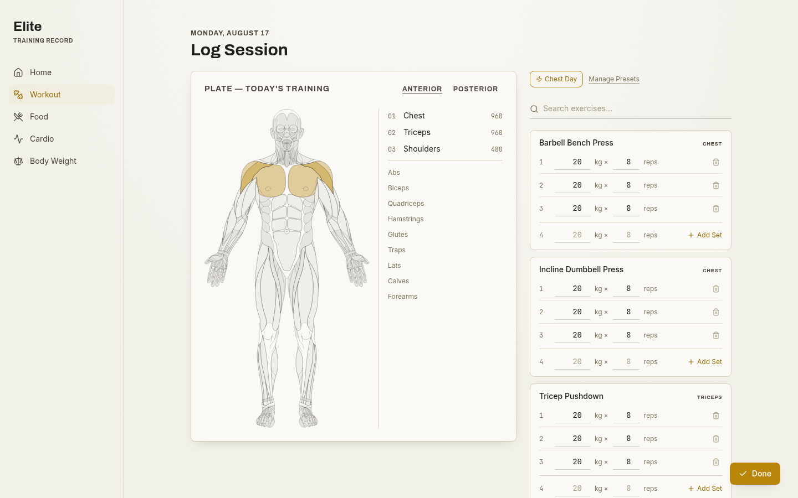
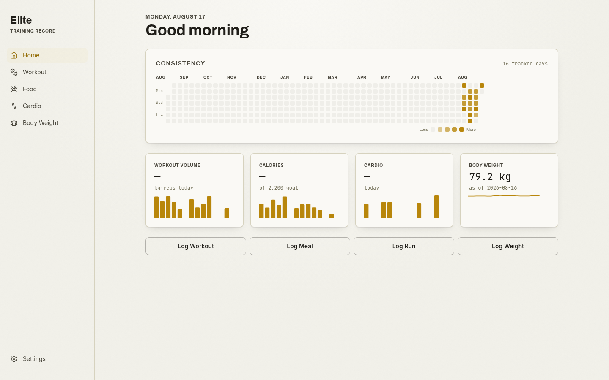

# Elite

A local-first PWA for tracking workouts, food, cardio, and body weight — built because I wanted one place that shows my effort visually instead of as spreadsheets across three different apps.



## Features

- **Workout** — muscle map that inks in with today's volume per muscle, tap to see what hit it, PR detection with confetti, one-tap session presets
- **Food** — barcode scan / USDA search / local cache, plus a custom dish library for your own recipes
- **Cardio** — session log with presets that scale by a multiplier ("Evening Cycling" × 1.5)
- **Body Weight** — daily log with trend chart and rolling average
- **Home** — GitHub-style consistency heatmap + 14-day trend charts across all four
- **Dark mode** — light, dark, or system, set in Settings



No backend, no account — everything lives in IndexedDB on your device. Installable, works offline once loaded. Export/import a JSON backup to move data between devices.

## Stack

React + Vite + TypeScript, Dexie (IndexedDB), Tailwind, Recharts, `vite-plugin-pwa`.

## Run it

```bash
npm install
npm run dev
```

Optional: for uncapped food search, add a free [USDA API key](https://fdc.nal.usda.gov/api-key-signup) to `.env` as `VITE_USDA_API_KEY` (falls back to a shared rate-limited demo key otherwise).
